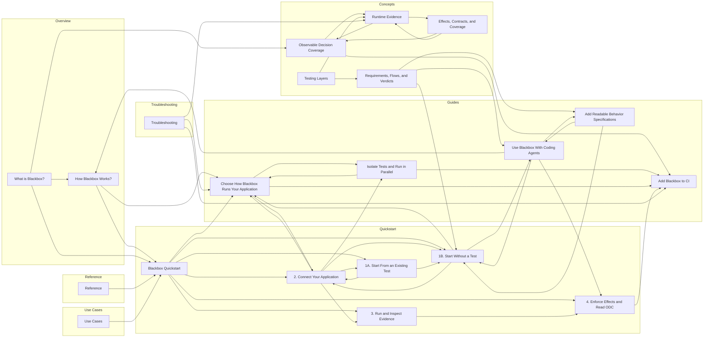

# Blackbox Docs Link Graph

Generated by `pnpm docs:graph` from the public Blackbox sidebar and internal Markdown/MDX links.

- Source docs: `src/content/docs/blackbox`
- Public IA source: `src/config/sidebar.ts`
- Public pages: 21
- Internal public links: 50

## Graph

```mermaid
flowchart LR
  subgraph Overview["Overview"]
    overview_what_is_blackbox["What is Blackbox?"]
    overview_how_blackbox_works["How Blackbox Works?"]
  end
  subgraph Quickstart["Quickstart"]
    quickstart["Blackbox Quickstart"]
    quickstart_build_behavioral_harness["1A. Start From an Existing Test"]
    guides_turn_requirements_into_system_test["1B. Start Without a Test"]
    quickstart_add_to_existing_test["2. Connect Your Application"]
    quickstart_add_runtime_evidence["3. Run and Inspect Evidence"]
    quickstart_enforce_runtime_effects["4. Enforce Effects and Read ODC"]
  end
  subgraph Concepts["Concepts"]
    concepts_testing_layers["Testing Layers"]
    concepts_runtime_evidence["Runtime Evidence"]
    concepts_effects_and_catalogs["Effects, Contracts, and Coverage"]
    concepts_specifications_flows_and_verdicts["Requirements, Flows, and Verdicts"]
    concepts_omc_dc_coverage["Observable Decision Coverage"]
  end
  subgraph Guides["Guides"]
    guides_set_up_the_testbed["Choose How Blackbox Runs Your Application"]
    guides_playwright_isolation_and_parallelism["Isolate Tests and Run in Parallel"]
    guides_recover_behavior_from_existing_tests["Add Readable Behavior Specifications"]
    guides_agent_skills["Use Blackbox With Coding Agents"]
    guides_reports_and_ci_gates["Add Blackbox to CI"]
  end
  subgraph Use_Cases["Use Cases"]
    use_cases["Use Cases"]
  end
  subgraph Reference["Reference"]
    reference["Reference"]
  end
  subgraph Troubleshooting["Troubleshooting"]
    troubleshooting["Troubleshooting"]
  end
  concepts_effects_and_catalogs --> concepts_omc_dc_coverage
  concepts_effects_and_catalogs --> concepts_runtime_evidence
  concepts_omc_dc_coverage --> concepts_runtime_evidence
  concepts_omc_dc_coverage --> guides_reports_and_ci_gates
  concepts_runtime_evidence --> concepts_effects_and_catalogs
  concepts_runtime_evidence --> concepts_omc_dc_coverage
  concepts_specifications_flows_and_verdicts --> guides_agent_skills
  concepts_specifications_flows_and_verdicts --> guides_recover_behavior_from_existing_tests
  concepts_specifications_flows_and_verdicts --> guides_turn_requirements_into_system_test
  concepts_testing_layers --> concepts_runtime_evidence
  concepts_testing_layers --> concepts_specifications_flows_and_verdicts
  guides_agent_skills --> guides_recover_behavior_from_existing_tests
  guides_agent_skills --> guides_turn_requirements_into_system_test
  guides_agent_skills --> overview_how_blackbox_works
  guides_agent_skills --> quickstart_enforce_runtime_effects
  guides_playwright_isolation_and_parallelism --> guides_reports_and_ci_gates
  guides_playwright_isolation_and_parallelism --> guides_set_up_the_testbed
  guides_recover_behavior_from_existing_tests --> guides_agent_skills
  guides_recover_behavior_from_existing_tests --> guides_turn_requirements_into_system_test
  guides_set_up_the_testbed --> guides_playwright_isolation_and_parallelism
  guides_set_up_the_testbed --> guides_reports_and_ci_gates
  guides_set_up_the_testbed --> quickstart_add_to_existing_test
  guides_turn_requirements_into_system_test --> guides_agent_skills
  guides_turn_requirements_into_system_test --> guides_set_up_the_testbed
  guides_turn_requirements_into_system_test --> quickstart_add_to_existing_test
  overview_how_blackbox_works --> guides_set_up_the_testbed
  overview_how_blackbox_works --> quickstart
  overview_what_is_blackbox --> concepts_omc_dc_coverage
  overview_what_is_blackbox --> overview_how_blackbox_works
  overview_what_is_blackbox --> quickstart
  quickstart --> guides_set_up_the_testbed
  quickstart --> guides_turn_requirements_into_system_test
  quickstart --> quickstart_add_runtime_evidence
  quickstart --> quickstart_add_to_existing_test
  quickstart --> quickstart_build_behavioral_harness
  quickstart --> quickstart_enforce_runtime_effects
  quickstart_add_runtime_evidence --> quickstart_enforce_runtime_effects
  quickstart_add_to_existing_test --> guides_playwright_isolation_and_parallelism
  quickstart_add_to_existing_test --> guides_set_up_the_testbed
  quickstart_add_to_existing_test --> guides_turn_requirements_into_system_test
  quickstart_add_to_existing_test --> quickstart_add_runtime_evidence
  quickstart_add_to_existing_test --> quickstart_build_behavioral_harness
  quickstart_build_behavioral_harness --> guides_turn_requirements_into_system_test
  quickstart_build_behavioral_harness --> quickstart_add_to_existing_test
  quickstart_enforce_runtime_effects --> guides_reports_and_ci_gates
  reference --> quickstart
  troubleshooting --> concepts_runtime_evidence
  troubleshooting --> guides_reports_and_ci_gates
  troubleshooting --> guides_set_up_the_testbed
  use_cases --> quickstart
```

## What The Graph Says

- The graph only includes pages that are present in the public Blackbox sidebar.
- Overview and Quickstart pages should point readers into concepts, guides, and reference pages when they need depth.
- Reference and troubleshooting pages may be sinks, but they should usually offer a recovery or next-step link back to a workflow.
- Pages with no incoming links are reachable from the sidebar, but not from the reading journey. That is a signal to add contextual links or confirm they are pure lookup pages.

## Edges

- Effects, Contracts, and Coverage
  - Observable Decision Coverage
  - Runtime Evidence
- Observable Decision Coverage
  - Runtime Evidence
  - Add Blackbox to CI
- Runtime Evidence
  - Effects, Contracts, and Coverage
  - Observable Decision Coverage
- Requirements, Flows, and Verdicts
  - Use Blackbox With Coding Agents
  - Add Readable Behavior Specifications
  - 1B. Start Without a Test
- Testing Layers
  - Runtime Evidence
  - Requirements, Flows, and Verdicts
- Use Blackbox With Coding Agents
  - Add Readable Behavior Specifications
  - 1B. Start Without a Test
  - How Blackbox Works?
  - 4. Enforce Effects and Read ODC
- Isolate Tests and Run in Parallel
  - Add Blackbox to CI
  - Choose How Blackbox Runs Your Application
- Add Readable Behavior Specifications
  - Use Blackbox With Coding Agents
  - 1B. Start Without a Test
- Choose How Blackbox Runs Your Application
  - Isolate Tests and Run in Parallel
  - Add Blackbox to CI
  - 2. Connect Your Application
- 1B. Start Without a Test
  - Use Blackbox With Coding Agents
  - Choose How Blackbox Runs Your Application
  - 2. Connect Your Application
- How Blackbox Works?
  - Choose How Blackbox Runs Your Application
  - Blackbox Quickstart
- What is Blackbox?
  - Observable Decision Coverage
  - How Blackbox Works?
  - Blackbox Quickstart
- Blackbox Quickstart
  - Choose How Blackbox Runs Your Application
  - 1B. Start Without a Test
  - 3. Run and Inspect Evidence
  - 2. Connect Your Application
  - 1A. Start From an Existing Test
  - 4. Enforce Effects and Read ODC
- 3. Run and Inspect Evidence
  - 4. Enforce Effects and Read ODC
- 2. Connect Your Application
  - Isolate Tests and Run in Parallel
  - Choose How Blackbox Runs Your Application
  - 1B. Start Without a Test
  - 3. Run and Inspect Evidence
  - 1A. Start From an Existing Test
- 1A. Start From an Existing Test
  - 1B. Start Without a Test
  - 2. Connect Your Application
- 4. Enforce Effects and Read ODC
  - Add Blackbox to CI
- Reference
  - Blackbox Quickstart
- Troubleshooting
  - Runtime Evidence
  - Add Blackbox to CI
  - Choose How Blackbox Runs Your Application
- Use Cases
  - Blackbox Quickstart

## No Outgoing Internal Links

- Add Blackbox to CI (/docs/blackbox/guides/reports-and-ci-gates)

## No Incoming Internal Links

- Testing Layers (/docs/blackbox/concepts/testing-layers)
- What is Blackbox? (/docs/blackbox/overview/what-is-blackbox)
- Reference (/docs/blackbox/reference)
- Troubleshooting (/docs/blackbox/troubleshooting)
- Use Cases (/docs/blackbox/use-cases)

## Docs On Disk But Not In Public Sidebar

- Build From a Dockerfile (/docs/blackbox/guides/build-from-dockerfile)
- Connect an External SUT (/docs/blackbox/guides/connect-external-sut)
- Run Compiled Artifacts (/docs/blackbox/guides/run-compiled-artifacts)
- Configure Source Maps and Service Layouts (/docs/blackbox/guides/source-maps-and-service-layouts)
- Use a Custom Provisioner (/docs/blackbox/guides/use-custom-provisioner)
- Use an Existing Compose Project (/docs/blackbox/guides/use-existing-compose)
- Package Responsibilities (/docs/blackbox/reference/api)
- Effect Contract Schema (/docs/blackbox/reference/catalog-schema)
- CLI Reference (/docs/blackbox/reference/cli)
- Configuration (/docs/blackbox/reference/configuration)
- Environment Configuration (/docs/blackbox/reference/environment-variables)
- Exit Codes (/docs/blackbox/reference/exit-codes)
- Files and Artifacts (/docs/blackbox/reference/files-and-artifacts)
- Effect Verification Model (/docs/blackbox/reference/matchers-and-effect-builders)
- Report Contracts (/docs/blackbox/reference/report-formats)
- Flow Identity (/docs/blackbox/reference/scenario-dsl)
- Testbed API (/docs/blackbox/reference/testbed-api)
- Effect Contract Failures (/docs/blackbox/troubleshooting/catalog-failures)
- Collect Diagnostics (/docs/blackbox/troubleshooting/diagnostics-and-debug-logs)
- Capture Cell and Testbed (/docs/blackbox/troubleshooting/docker-and-testbed)
- Feature Drift (/docs/blackbox/troubleshooting/feature-drift)
- Empty or Incomplete Capture (/docs/blackbox/troubleshooting/no-spans-captured)
- Report a Bug (/docs/blackbox/troubleshooting/reporting-a-bug)
- Cover Behavior Before a Refactor (/docs/blackbox/use-cases/covering-before-refactor)
- Prevent an Incident Regression (/docs/blackbox/use-cases/incident-regression)
- Modernize a Legacy System (/docs/blackbox/use-cases/legacy-modernization)
- Verify a Microservice Workflow (/docs/blackbox/use-cases/microservices-regression)

## Public Pages Linking Outside The Public Sidebar

- Effects, Contracts, and Coverage
  - /docs/blackbox/reference/catalog-schema
- Add Blackbox to CI
  - /docs/blackbox/reference/exit-codes
  - /docs/blackbox/reference/files-and-artifacts
  - /docs/blackbox/reference/report-formats
- Choose How Blackbox Runs Your Application
  - /docs/blackbox/guides/build-from-dockerfile
  - /docs/blackbox/guides/connect-external-sut
  - /docs/blackbox/guides/run-compiled-artifacts
  - /docs/blackbox/guides/source-maps-and-service-layouts
  - /docs/blackbox/guides/use-custom-provisioner
  - /docs/blackbox/guides/use-existing-compose
- 2. Connect Your Application
  - /docs/blackbox/guides/use-existing-compose
- Reference
  - /docs/blackbox/reference/api
  - /docs/blackbox/reference/catalog-schema
  - /docs/blackbox/reference/cli
  - /docs/blackbox/reference/configuration
  - /docs/blackbox/reference/environment-variables
  - /docs/blackbox/reference/exit-codes
  - /docs/blackbox/reference/files-and-artifacts
  - /docs/blackbox/reference/matchers-and-effect-builders
  - /docs/blackbox/reference/report-formats
  - /docs/blackbox/reference/scenario-dsl
  - /docs/blackbox/reference/testbed-api
- Troubleshooting
  - /docs/blackbox/troubleshooting/catalog-failures
  - /docs/blackbox/troubleshooting/diagnostics-and-debug-logs
  - /docs/blackbox/troubleshooting/docker-and-testbed
  - /docs/blackbox/troubleshooting/feature-drift
  - /docs/blackbox/troubleshooting/no-spans-captured
  - /docs/blackbox/troubleshooting/reporting-a-bug
- Use Cases
  - /docs/blackbox/use-cases/covering-before-refactor
  - /docs/blackbox/use-cases/incident-regression
  - /docs/blackbox/use-cases/legacy-modernization
  - /docs/blackbox/use-cases/microservices-regression
